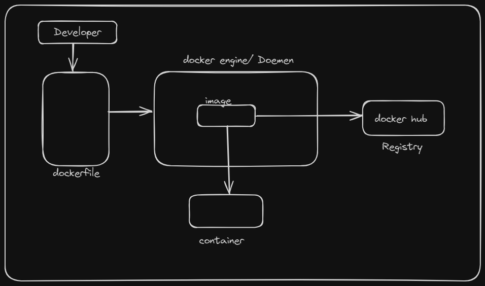
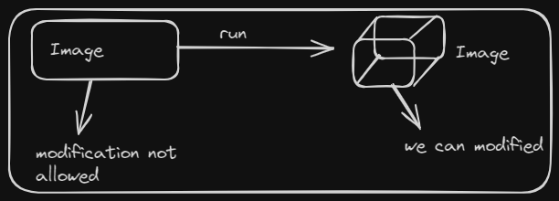

# Docker
- Docker is an open source Centralised Platform designed to create, deploy and run applications.
- Docker uses Container on the host O.S to run applications. It allows applications to use the same linux kernel as System on the Computer, rather than Creating a Whole Virtual O.S.
- We Can install Docker on any O.S but Docker engine runs natively on linux distribution.
- Docker is written in `go` language.
- Docker is a tool that performs O.S level Virtualization, also known as Containerization.
- Before Docker, many users faces the problem that a particular Code is running in the developer's system but not in the User's System.
- Docker was first Release in March 2013. It is developed by Solomon Hykes and Sebastian Pahl.
- Docker is a Set of platform as service that uses O.S level virtualization whereas VMWare uses Hardware level Virtualization.

# Advantages of Docker
- No pre-allocation of RAM.
- Docker enables you to build container image and use that image same image across every step of the deployment process.
- Less Cost
- It is light in Weight.
- It can run on physical H/w /Virtual H/w or on Cloud.
- You can re-use the image.
- It took very less time to Create Container.

# Disadvantages of Docker

- Diffcult to manage large amounts of Containers.
- Docker does not provide Cross-platform compatibility means if an application is designed to run in docker Container on Windows, the It can't run on linux or vice versa.
- Docker is suitable when the  development o.s and testing o.s are same if the o.s is different, we should use V.M.



# Components of Docker

## Docker Daemon 

- Docker Daemon run on the host O.S.
- It is responsible for running the docker containers and manage docker services.

## Docker Client
- Docker users can interact with Docker daemon throught client (CLI).
- Docker client uses command line arguments and Rest API to communicate with Docker daemon.
- When a client runs any server command on the docker client terminal, the client sends these docker commands to the Docker daemon.
- If is possible for docker client to communicate with more than one Docker daemon.

## Docker Host

- Docker host is used to provide an environment to execute and run applications. It contains docker daemon, images, containers, network and storages.

## Docker Hub/Registry

- Docker registry manages and stores the docker images.
- These are two types of registries in the docker. <br>
1. Public Registry => Public registry is also called the docker hub. <br>
2. Private Registry => Private registry is used to share images within the enterprise. <br>

## Docker images

- Docker images are the read only binary templates used to create docker containers. <br>
- Single file with all dependencies and configuration required to run a program.

### Ways to create an Images
```bash
1. Take image from docker hub.
2. Create image from dockerfile
3. Create image from existing docker containers.

```

## Docker Container

- Containers hold the entire packages that is needed to run the application.
- In other words, We can say that, the image is a template and the container is a copy of that template.
- Containers is like virtual Machines.
- Images become container when they run on docker engine.



# Docker Commands

To See all images present in your local Machine.

```bash
docker images
```

To find out images in docker hub

```bash
docker search jenkins
```
To download image from docker hub to local machine
```bash
docker pull jenkins
```
To give name to container
```bash
docker run -it --name soma ubuntu /bin/bash
```
To check service is start or not
```bash
Service docker start
```
To Start Container
```bash
docker start soma 
```
To go inside container
```bash
docker attach soma
```
To see only running containers
```bash
docker ps
```
To stop container
```bash
docker stop soma
```
To delete container
```bash
docker rm soma
```
Create the image
```bash
docker build -t your_image_name:tag .
```
## Step of used Docker
- Login into AWS account and Start  your EC2 instance and connect with the terminal using key.
- Now we have to create container from  our own image.<br>
Therefore, Create one container first
- ` docker run -it --name soma ubuntu /bin/bash`
- cd tmp/ <br>
Now create one inside this tmp directory.<br>
`touch myfile` <br>

Now if you want to see the difference between the base image and changes on it then.
- `docker diff soma `
```cmd
o/p -> 
C /root
A / root/bash-history
C /temp
A /temp/myfile
# A is for Append or addition
# C is for Change
# D is for Delete
```
- Note-> Create  image of this container <br>
```ubuntu
docker commit newcontainer updateimage 
# updateimage is Name of the image
# newcontainer is container name
# update
docker images
# show list all images
```
Note-> create container from this image
```ubuntu
docker run -it --name somacontainer updateimage /bin/bash
```
- After this command you go to inside the container.
```bin 
    ls
    # bin  boot  dev  etc  home  lib  lib64  media  mnt  opt  proc  root  run  sbin  srv  sys  tmp  usr  var
    ls
    myfile
```
## Docker Components & diff Commands
## `Dockerfile`: 
- Dockerfile is basically a text file. It contains
some set of instruction.
- Automation of Docker image Creation.

## Docker Components

### `FROM`: 
- for base image this command must be on top of Dockerfile.
### `RUN`: 
- To execute commands, it will create a layer in image.
### `MAINTAINER`: 
- Auth/Owner/Description
### `COPY`: 
- Copy files from local system (docker vm). we need to provide source and destination(we can't download file from internet and any remote repo).
### `ADD`: 
- In this we can download files from internet and any remote repo.
### `EXPOSE`: 
- To expose points such as port 8080 for tomcat, port 80 for nginx etc.
### `WORKDIR`: 
- To set working directory for a container.
### `ENTRYPOINT`: 
- Similar to CMD, but has higher priority over CMD, first commands will be executed by ENTRYPOINT only.
### `ENV`:
- Environment Variables.

#### Step of create docker container
- 1. Create a file named Dockerfile
- 2. Add instructions in Dockerfile
- 3. Build dockerfile to Create image.
- 4. Run image to Create Container.


